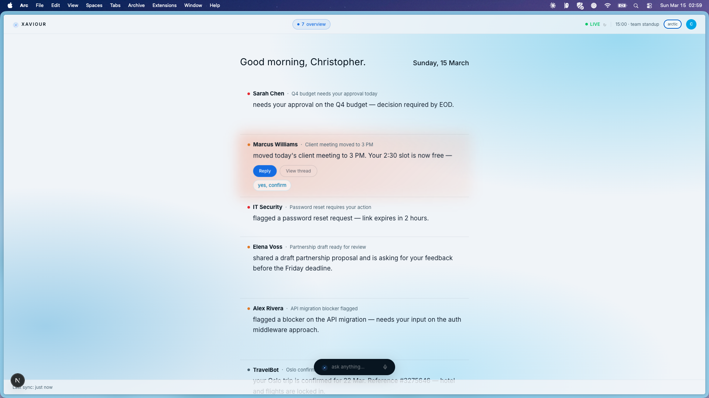
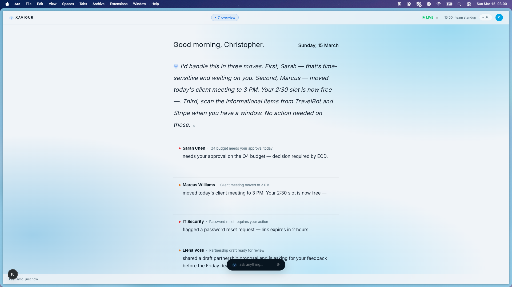
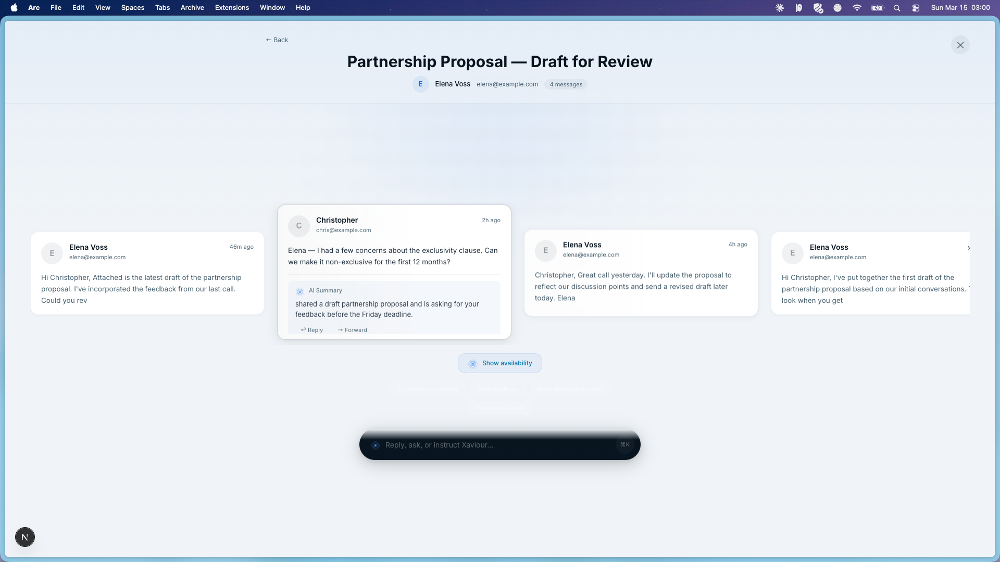
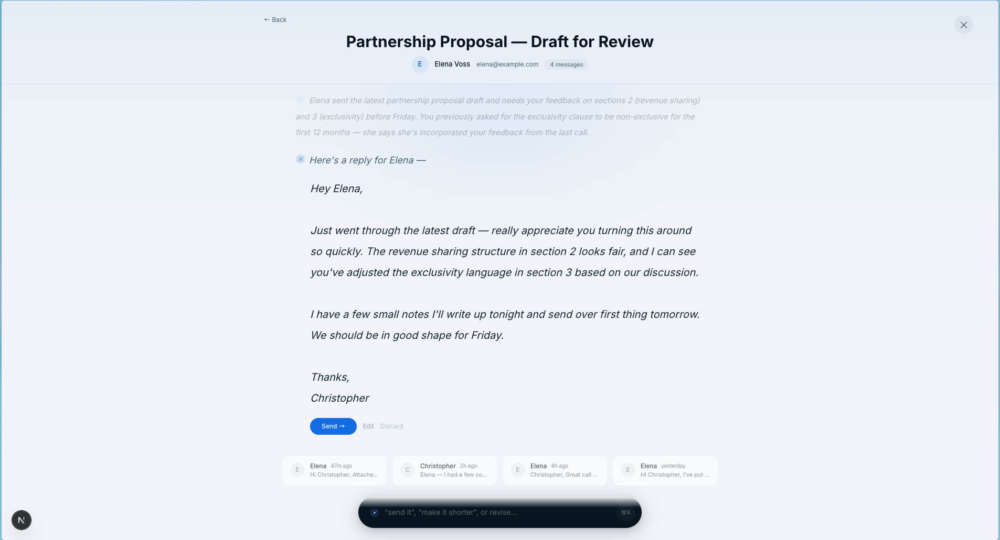
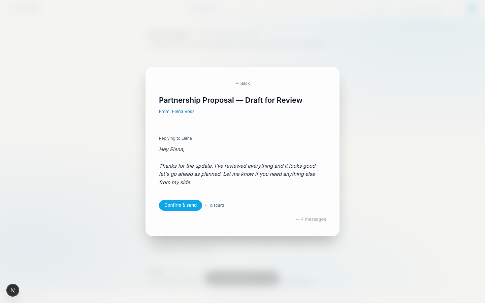
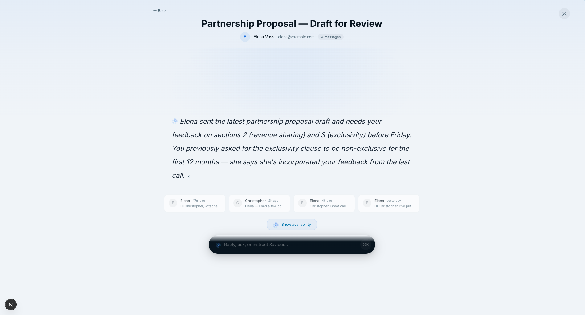
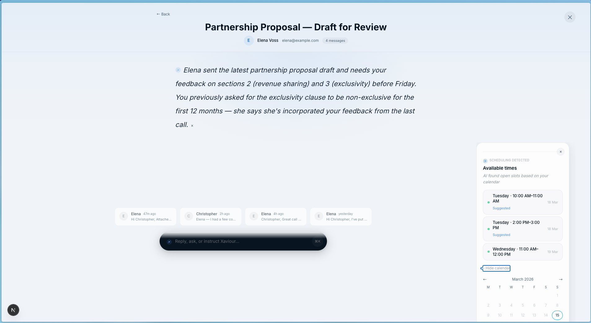

# Xaviour AI Demo

**Email, rewritten.**

Xaviour is an AI-first email experience that turns inbox noise into a calm narrative workflow. This public repository is a **demo version** of Xaviour designed to showcase the product experience without exposing proprietary production systems.

**[xaviour.ai](https://xaviour.ai)** — Learn more and join the waiting list
**[demo.xaviour.ai](https://demo.xaviour.ai)** — Try the live demo

> **Demo Notice** — This repository showcases the Xaviour experience and interface only. The AI intelligence, proprietary prompts, real integrations (Gmail, Calendar, OAuth), and production backend are **not included**. All responses are simulated using mock logic to demonstrate how the product feels and flows — not how it thinks. The real Xaviour is significantly more capable than what you see here.

---

## The Morning Brief

Your inbox distilled into a calm, narrative overview — no list of subjects, no clutter. Xaviour tells you what matters and why.



## AI Composer

Ask Xaviour anything. The command bar responds with rich, editorial guidance — prioritizing your inbox and telling you exactly where to start.

<p>
  
  
</p>

## Thread Workspace

Open any thread to enter a focused workspace. Xaviour reads the full conversation and gives you a narrative summary — no skimming required. Hover over message cards to preview individual exchanges.

<p>
  
  
</p>

## AI-Drafted Replies

One click and Xaviour drafts a contextual reply in your voice. Review, edit, or send — with full thread awareness.

<p>
  
  
</p>

## Smart Context — Calendar & Scheduling

Xaviour surfaces availability and scheduling context alongside the conversation, so you never have to leave the thread to check your calendar.

<p>
  
  
</p>

---

## What this demo shows

This demo includes a mock version of the Xaviour experience, including:

- a narrative brief of important emails
- an intelligent thread workspace
- a premium AI composer bar
- draft / revise / forward / send simulation
- scheduling / availability demo flows
- handled-state behavior for completed threads

## Important Demo Notice

This repository is a **public demo only**.

It uses:

- **mock data**
- **simulated API routes**
- **demo-only AI behavior**
- **fictional email threads and contacts**

This repository does **not** include:

- real Gmail or calendar integrations
- real OAuth flows
- real AI provider calls
- production prompts
- proprietary orchestration logic
- internal infrastructure or private backend systems

## Local Development

### Requirements

- Node.js 18+ or newer
- npm

### Run locally

```bash
npm install
npm run dev
```

Then open:

```text
http://localhost:3000
```

## Demo Behavior

Everything in this repo is designed to behave like a realistic product demo while remaining safe for public GitHub publication.

Examples:

- AI composer responses are simulated
- drafts are generated from mock/demo logic
- send/forward actions are simulated only
- scheduling suggestions are demo-only

## Why this repo exists

This repository is intended to:

- showcase the Xaviour product experience
- demonstrate the Narrative email workflow
- provide a safe public demo
- support public product storytelling and launch visibility

It is **not** the private production repository.

## License

This repository is licensed under **AGPLv3**.

See the `LICENSE` file for details.

Xaviour AI Demo is open source under AGPLv3. For commercial licensing contact christopher@xaviour.ai.

## Commercial Licensing

For commercial licensing, private deployment, OEM/white-label use, or proprietary usage, contact:

**christopher@xaviour.ai**

See `COMMERCIAL_LICENSE.md` for more information.

## Security

If you discover a security issue, please report it privately to:

**christopher@xaviour.ai**

See `SECURITY.md` for the disclosure policy.

## Disclaimer

This repository is a **UI and experience demo only**. It does not contain the AI models, proprietary prompts, orchestration logic, or production integrations that power the real Xaviour product. All AI responses, drafts, and suggestions shown here are generated from mock templates — they demonstrate the workflow, not the intelligence. The production version of Xaviour is significantly more capable and is not represented by this codebase.
